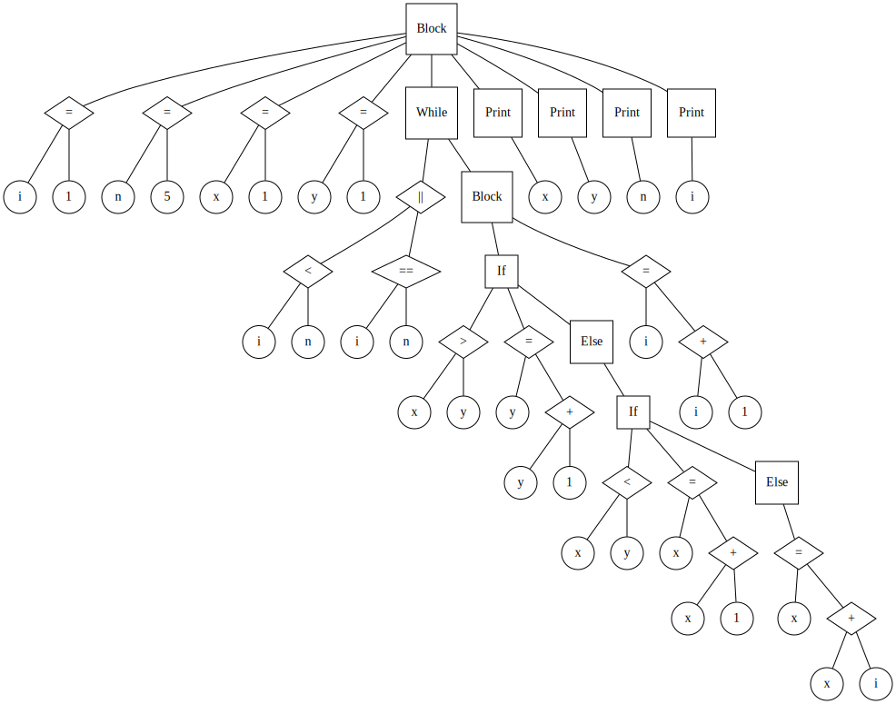

# Compiler

## Diagrama Sintático


## EBNF

```
BLOCK = "{", { STATEMENT }, "}" ;
STATEMENT = (( λ | ASSIGNMENT | PRINT ), ";" | ( LOOP | CONDITION | BLOCK )) ;
ASSIGNMENT = IDENTIFIER, "=", REL_EXPRESSION ;
PRINT = "Print", "(", REL_EXPRESSION, ")" ;
LOOP = "while", "(", REL_EXPRESSION, ")", STATEMENT ;
CONDITION = "if", "(", REL_EXPRESSION, ")", STATEMENT, ( λ | "else", STATEMENT ) ;
REL_EXPRESSION = EXPRESSION, { ("==" | ">" | "<"), EXPRESSION } ;
EXPRESSION = TERM, { ("+" | "-" | "||"), TERM } ;
TERM = FACTOR, { ("*" | "/", "&&"), FACTOR } ;
FACTOR = (("+" | "-" | "!"), FACTOR) | NUMBER | "(", EXPRESSION, ")" | IDENTIFIER | "Read", "(", ")" ;
IDENTIFIER = LETTER, { LETTER | DIGIT | "_" } ;
NUMBER = DIGIT, { DIGIT } ;
LETTER = ( a | ... | z | A | ... | Z ) ;
DIGIT = ( 1 | 2 | 3 | 4 | 5 | 6 | 7 | 8 | 9 | 0 ) ;
```

## Visualização

O script main também gera um arquivo em linguagem DOT que pode ser usado para visualizar a AST do código.

Você pode desenhá-lo usando o software que desejar ou, caso possua graphviz instalado, executar o script `draw.py` e desenhar a AST como essa abaixo:

